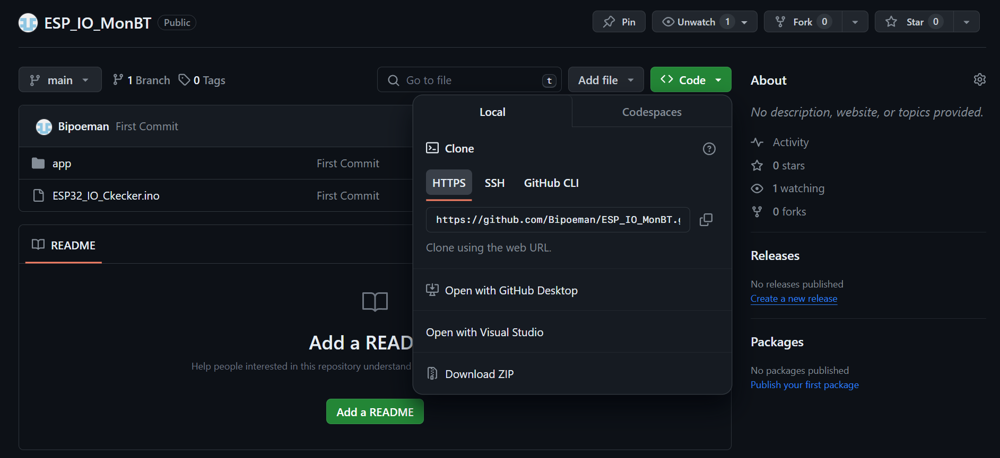
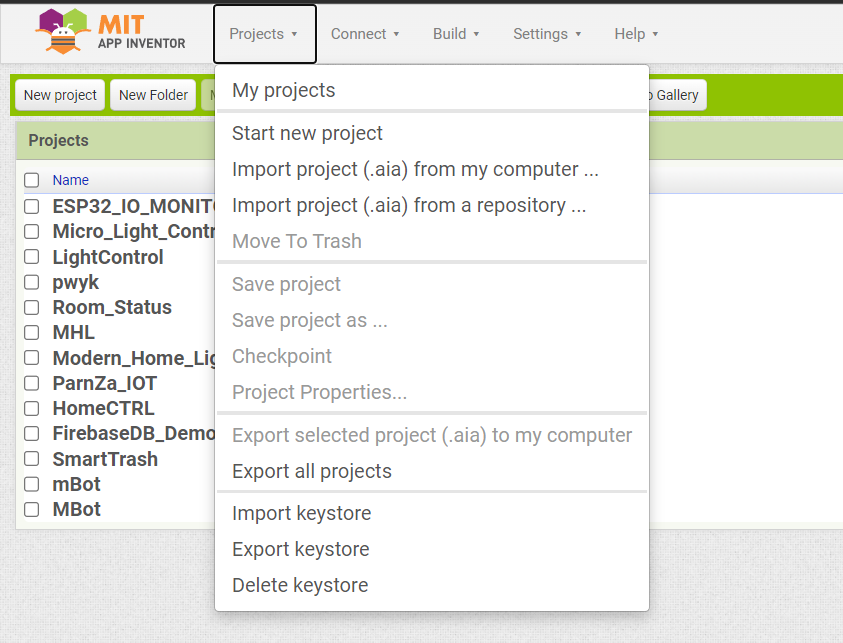

# Project ESP IO Reader BT
## การโหลดไปแก้ไข
กด Download โฟลเด้อจากตรงนี้ แล้วก็เลือก `Download ZIP` ได้เลยครับ

## ESP32 Code Edit
การแก้ไขโค้ดแก้ได้ตามนี้นะครับ <br><br>
ในส่วนของ ESP32 อันนี้คือท่อนแรกของโค้ดนะครับ
BluetoothSerial ESP32BT;
```cpp
#define LED 2
#define bluetoothName "ESP32_MyLED"
#define NUM_PINS 13
bool isconnected = false;
bool hasconnected = false;
int pin[NUM_PINS] = {26,25,17,16,27,14,12,13,5,23,19,18,4};
```
สามารถแก้ชื่อ Bluetooth ของ ESP32 ได้ในบรรทัดนี้นะครับ
```cpp
#define bluetoothName "ESP32_MyLED"
```
แก้ `"ESP32_MyLED"` เป็นชื่ออะไรก็ได้เลยครับ

## App Inventor import
ในหน้าแรกของ App Inventor ไปที่แทป Project > Import project (.aia) from my computer. จากนั้นก็เลือกไฟล์ที่อยู่นามสกุล `.aia` ใน Folder app ที่อยู่ในนี้ได้เลยครับ
